# 项目名称
基于 java+servlet+jsp+mysql实现的在线服装商城（期末大作业，毕业设计）
java商城，servlet商城，jsp商城，mysql商城

## 特性/功能

基于 java+servlet+jsp+mysql实现的在线服装商城

期末大作业，毕业设计

mvc 模式   

具体功能如下截图：
  登录，注册，购物车，商品收索，收藏，订单，支付，用户管理，商品管理，订单管理，购物车管理，分类管理等
  

## 用户端功能以及截图
### 1.首页

### 2.登录                
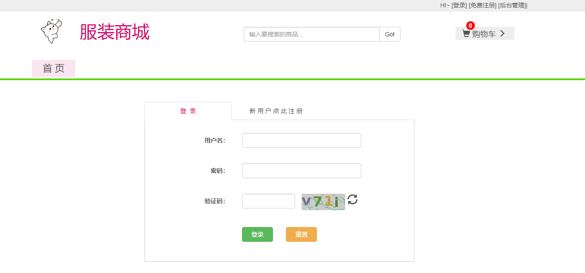

### 3.注册
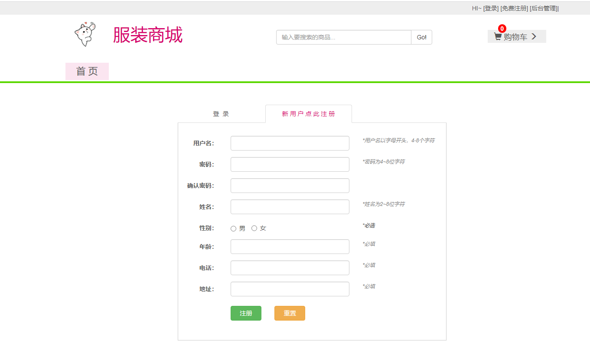

### 4.分类展示

### 5.商品详情
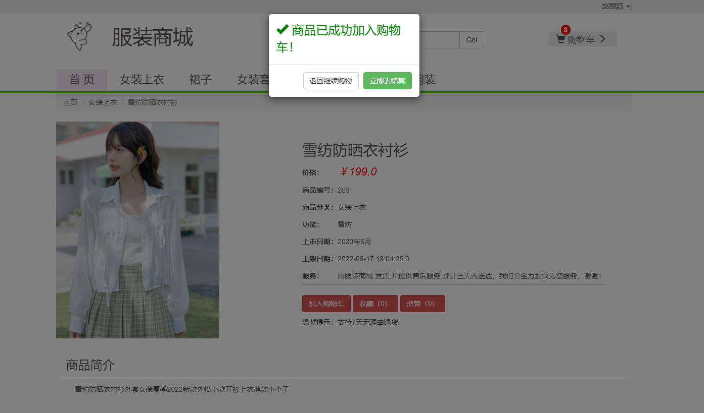

### 6.我的购物车

### 7.提交订单
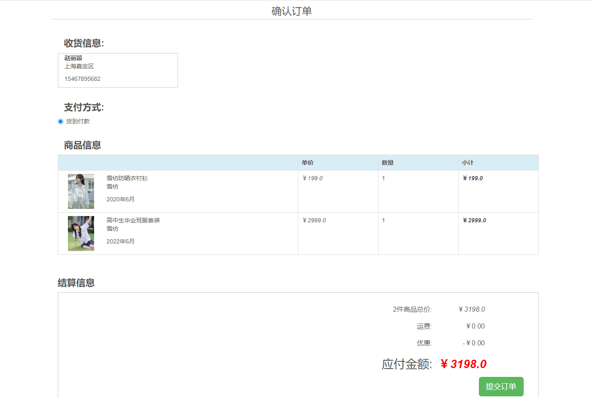

### 8.支付
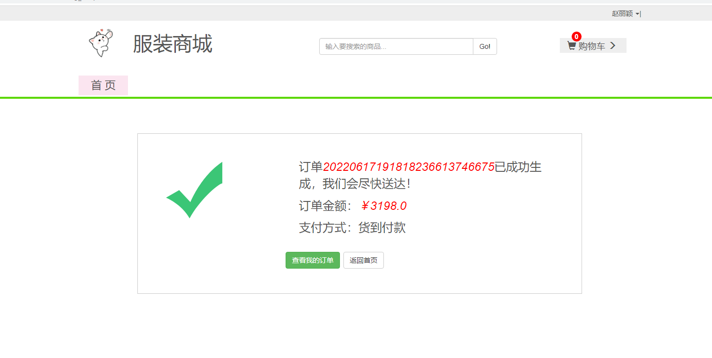

### 9.我的订单

### 10.我的收藏

### 11.搜索功能

## 用户端功能以及截图

### 1.管理登录

### 2.用户管理【增，删，改，查】
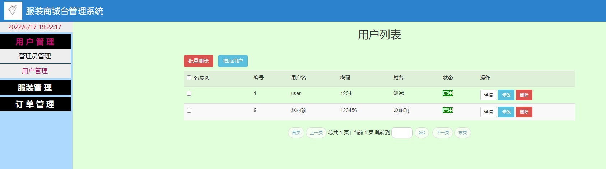

### 3.商品管理【增，删，改，查】
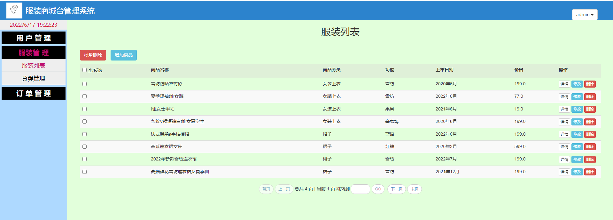

### 4.商品添加
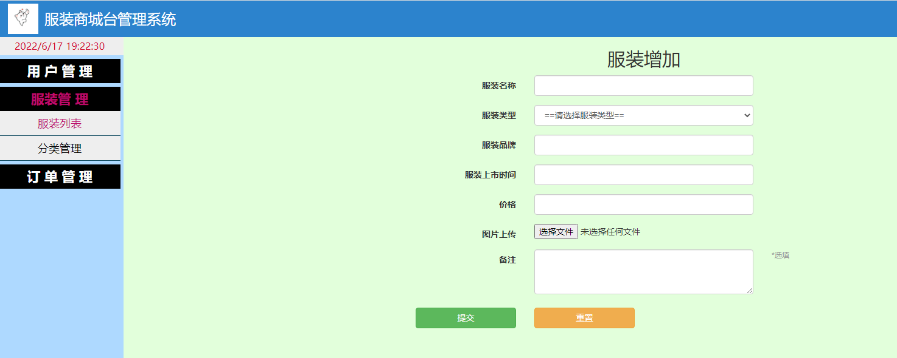

### 5.商品修改

### 6.商品分类管理【增，删，改，查】
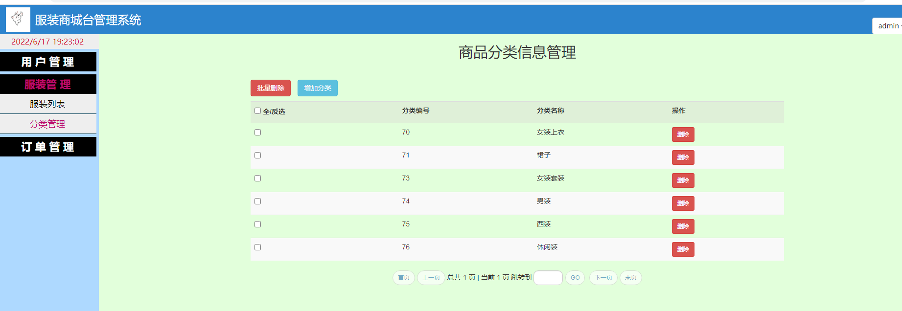

### 7.订单管理【发货】
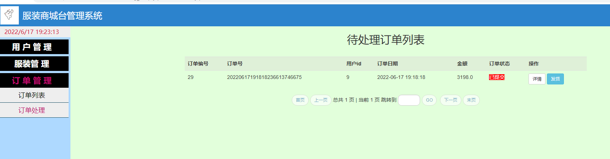
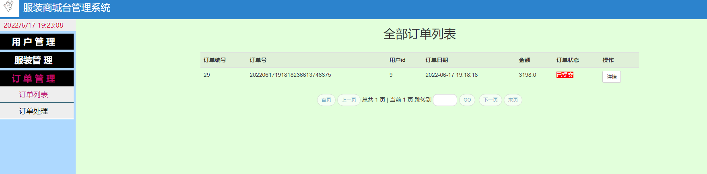

## 工程结构
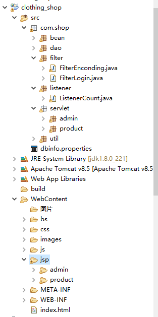

## 文档【课程报告】
.png)

## 安装与下载【idea与eclipse与myeclipse均可运行】
### 加QQ：2108657327 免费获取项目源代码！！！        

